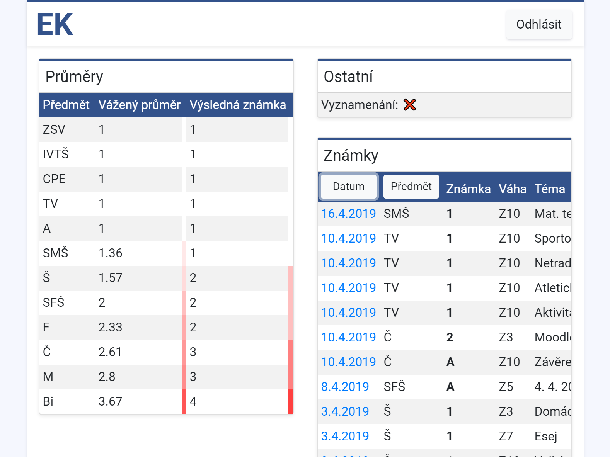

# Elektronická Klasifikace (former Better iSAS)
[](https://travis-ci.org/JouzaLoL/better-isas)

Open-source frontend alternative to the [iSAS](http://isas.gytool.cz) application.

### Due to issues with official iSAS servers, we are currently unable to host a live version. Please refer to [Getting Started](#gs) to run locally.

## Screenshots

## License notice

This work is licensed under CC-BY-NC-ND 4.0 with the following additional limitations:

Contribution purposes = contributing to this project.

- You may not copy this software or its parts for other than contribution purposes.
- You may not use this software or its parts for any other purpose than reference and learning.
- If you wish to contribute to the project, you may run a development version of the project, you may not, however, use this development version for purposes other than development and contribution to this project.
- Failure to comply with the above terms & the license will result in legal action.
- The owner of the project reserves the right to change the license terms at any moment.

## Getting Started
<a name="gs"></a>
Download and install [Node.js](https://nodejs.org/en/)
```shell
$ npm install
$ npm start
```
Server will be started on `localhost:8080` by default

## Built With

* [Express](https://expressjs.com/) - web framework
* [Travis CI](https://travis-ci.org) - free CI for open-source projects

## Contributing

Please read [CONTRIBUTING.md](CONTRIBUTING.md) for details on our code of conduct, and the process for submitting pull requests to us.

## License

This project is licensed under the MIT License - see the [LICENSE.md](LICENSE.md) file for details
